# Astrophotography Tutorial: Image Stacking in Siril
##### By Sathvik Acharya
  
Astrophotography allows us to capture the beauty of the night sky, but due to long exposure times and low light conditions, a single image often contains noise and lacks detail. To overcome this, astrophotographers use a technique called image stacking. By combining multiple images of the same scene, we can enhance the signal-to-noise ratio and reveal more celestial details.
  
In this guide, I will walk you through the process of stacking your astrophotography images using **Siril**, a powerful, free software designed for astronomical image processing.
  
### Why use Siril?
  
Siril stands out as a specialized software for astrophotography image stacking, offering a range of powerful tools tailored for high-quality astronomical image processing. Key functionalities include precise alignment and calibration tools that correct shifts and distortions from atmospheric and optical factors, delivering sharp, accurate stacks. Siril’s stacking algorithms effectively reduce noise-critical in low-light astrophotography-while preserving fine details, resulting in clear, vibrant images. Additionally, Siril provides background extraction, color calibration, and photometric color correction, enhancing the natural colors of celestial objects. The software also supports both automated workflows and manual controls, accommodating users from beginners to advanced. As a free, open-source tool, Siril is continually updated, making it a robust and accessible choice for astrophotography enthusiasts.
  
### Installing Siril
 You can download and install Siril directly from the official website: https://siril.org/.
  
##### Here are the steps for installation on different platforms:
  
**Linux Installation**
  
**For Ubuntu/Debian**
>sudo apt install siril
  
**For Fedora**
>sudo dnf install siril
  
**For Arch Linux**
  
>sudo pacman -S siril
  
### Prerequisites
  
To perform image stacking, you need a set of multiple images of the same celestial object or field. Ensure that these images are taken under similar conditions and with consistent settings to achieve optimal stacking results. The more images you have, the better the final result will be, as stacking helps to reduce noise and enhance details.
  
#### Practice Astrophotography Image Stacking
  
You can download practice images for astrophotography image stacking from the following sources to get hands-on experience:
  
- [Astropix](https://www.astropix.com/html/processing/practice_files.html )
- [AstroBackyard](https://astrobackyard.com/your-astrophoto-skills/ )
  
These resources provide excellent data sets for practicing your image stacking and processing techniques.
  
  
#### Image Calibration
  
##### Organizing Your Image Files for Stacking in Siril
  
Before you begin processing your astrophotography images in Siril, it's essential to organize your files properly. 
  
1. Start by creating a main directory named after the object or star cluster you're working. (eg: **M31** - The Andromeda Galaxy)
  

  
  
2. Inside this directory, create four subdirectories: **lights, darks, biases, and flats**.
  
   
  
  
* **Lights**: Place all your raw images of the object (the ones you plan to stack) in the lights folder.
* **Darks**: Place your dark frame images here to account for sensor noise.
* **Biases**: Add your bias frames in this folder to correct for readout noise.
* **Flats**: Store flat field images to correct for vignetting or dust on your sensor.
  
3.  In this step, we will be placing only the light files (the raw images) into the **lights** folder. For this guide, we'll be working exclusively with these light images.
  
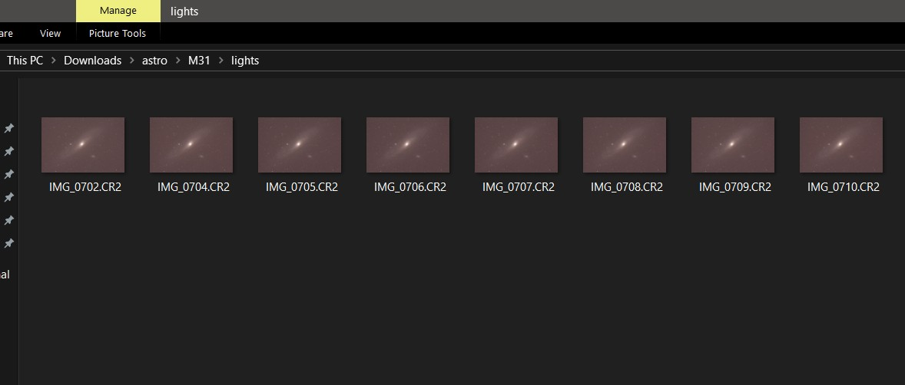   
  
**Note:** These directories are crucial because Siril's built-in scripts rely on them for executing the stacking process. If these directories are not properly created and filled with the corresponding images, the scripts won't run, and you'll encounter errors. By following this structure, you'll ensure a smooth stacking workflow.
  
### Launching Siril
  
#### Setting up the workspace
  
By default, Siril might open with a different working directory than where your images are stored. To ensure that Siril can access your images and perform stacking correctly, follow these steps to change the working directory:
  
1. Open Siril: Launch Siril on your computer.
  

  
  
2. To change the current directory in Siril, click the home icon located in the top-left corner of the window.
  

  
  
3. This action will open a file browser, allowing you to navigate to and select the directory where your images are stored.
  
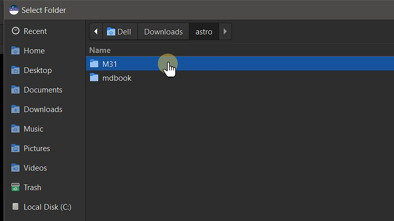
  
4. After navigating to the directory containing the lights, darks, flats, and biases folders, click **Open** to set this directory as your working directory in Siril.
  

  
### Installing Scripts
  
1. To install scripts, click the **three-dash** icon in the top-right corner of the Siril window.
  

  
2. Click on **Get Scripts**.
  

  
3. After clicking Get Scripts, you will be redirected to Siril’s documentation page. From there, locate the [GitLab](https://gitlab.com/free-astro/siril-scripts ) link under the **Getting More Scripts** section and click on it.
  

  
4. Click **preprocessing**.
  
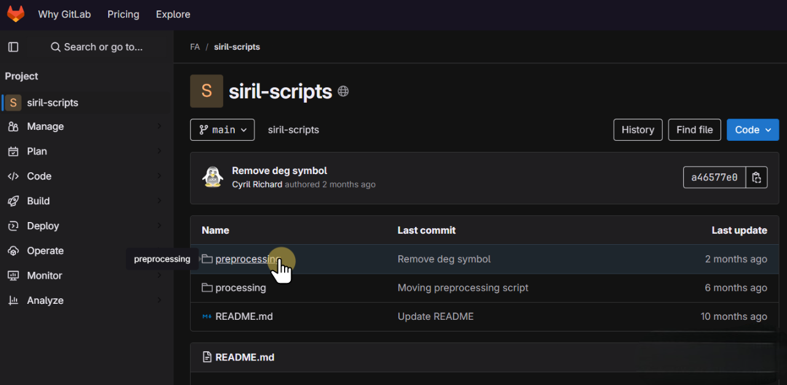
  
5. Click **OSC_Preprocessing_WithoutDBF.ssf**
  
**Note:** We will be downloading the OSC_Preprocessing_WithoutDBF.ssf script, as we are working exclusively with light frames.
  

  
6. Download the **OSC_Preprocessing_WithoutDBF.ssf** 
  

  
After downloading the script, place it in the following directory:
  
> /This PC/Local Disk (C:)/Program Files/Siril/scripts/OSC_Preprocessing_WithoutDBF.ssf
  
Once the scripts are installed and placed in the correct directory, you're all set to begin the stacking process in Siril.
  
### Stacking Images
  
1. Click **Scripts** in the top menu.
  

  
2. Select **OSC_Preprocessing_WithoutDBF** from the list of available scripts.
  

  
3. Click **Run** to execute the script.
  

  
4. Wait for the script to complete. You can view the progress of the execution in the **console** window.
  
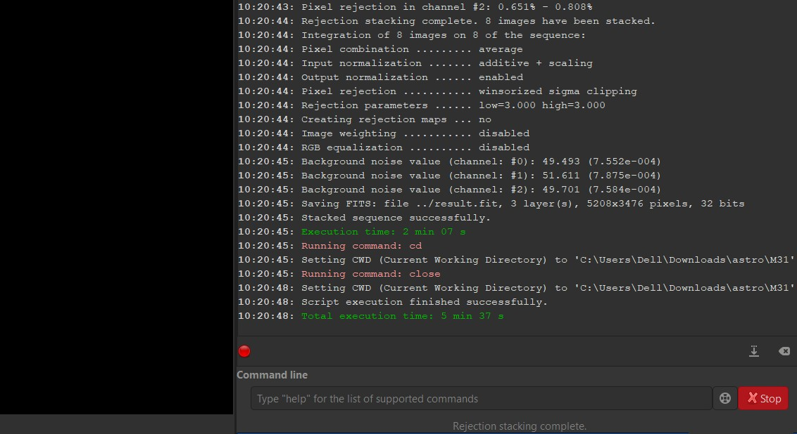
  
The final stacked image will be saved in the main directory named M31.
  
5. To open the final stacked image, click **Open** in the Top Menu.
  

  
6. The final stacked image will be named **result.fit** and saved in FITS format. 
Select **result.fit** and click Open at the bottom to load the image.
  
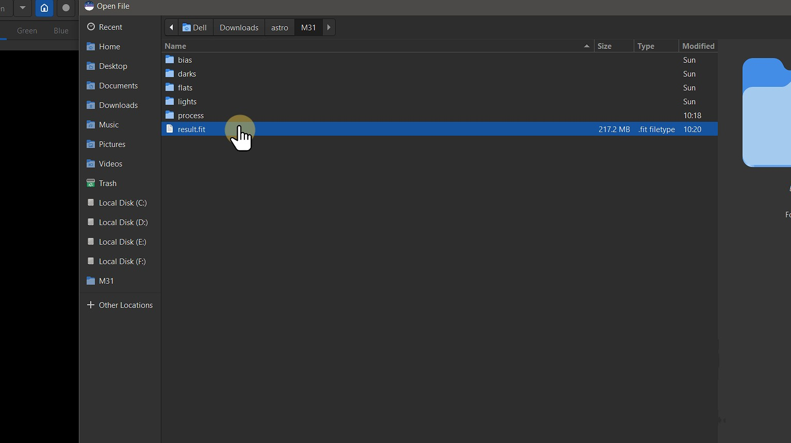
  
7. This is the raw, stacked image of M31 displayed in linear view.
  

  
8. To switch from Linear to Autostretch, simply click on **Linear** and select **Autostretch** to adjust the image view.
  
  
  
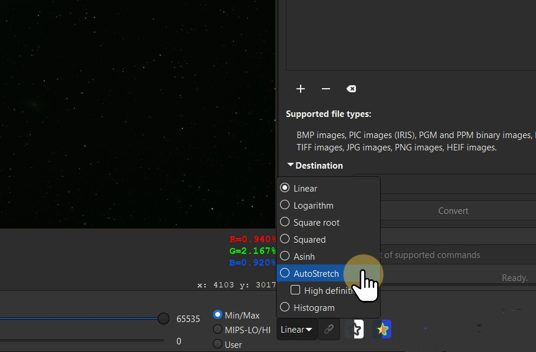
  
**Note:** Autostretch applies a temporary stretch to the image's data, making faint details more visible without permanently altering the raw data. This is useful for previewing your stacked image before performing any further post-processing.
  

  
**Note:** After applying Autostretch to the stacked image, you may notice green noise. This is common and can be corrected during further processing. 
  
9. To switch to Histogram View, select **Histogram** from the view options. Switching to Histogram View gives you finer control over the image's tonal range, enabling better visualization of details and adjustment of exposure.
  

  
### Background Extraction
  
To begin post-processing, first crop the artifacts and noise around the edges, which are visible in the Histogram View.
  
1. To crop, **left-click** on the image, select the area you wish to keep, then right-click and choose **Crop** to apply the changes.
  
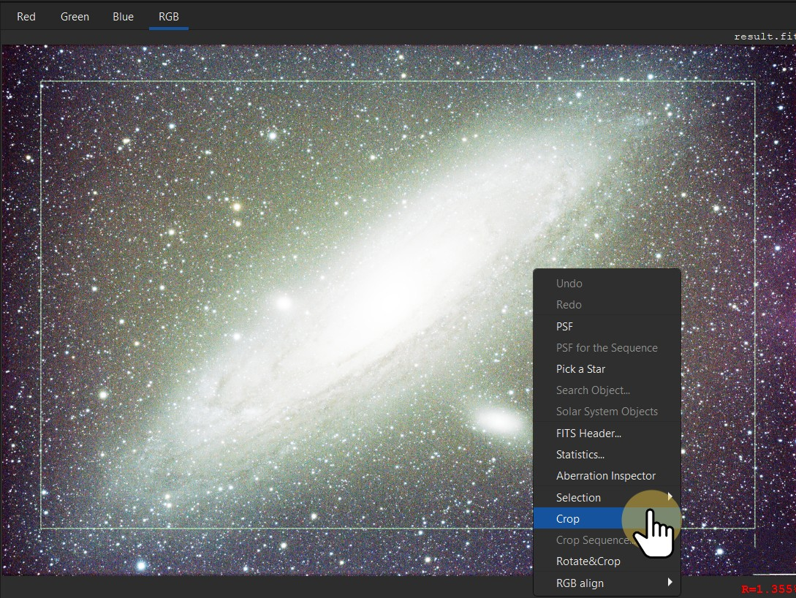
  
After cropping, switch back to Autostretch view to enhance visibility, and then start the Background Extraction process.
  
2. Navigate to **Image Processing**
  
Background extraction in Siril is a process that helps to remove unwanted background noise or variations from your astronomical images.
  
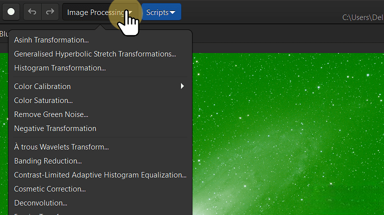
  
3. Select **Background Extraction**.
  
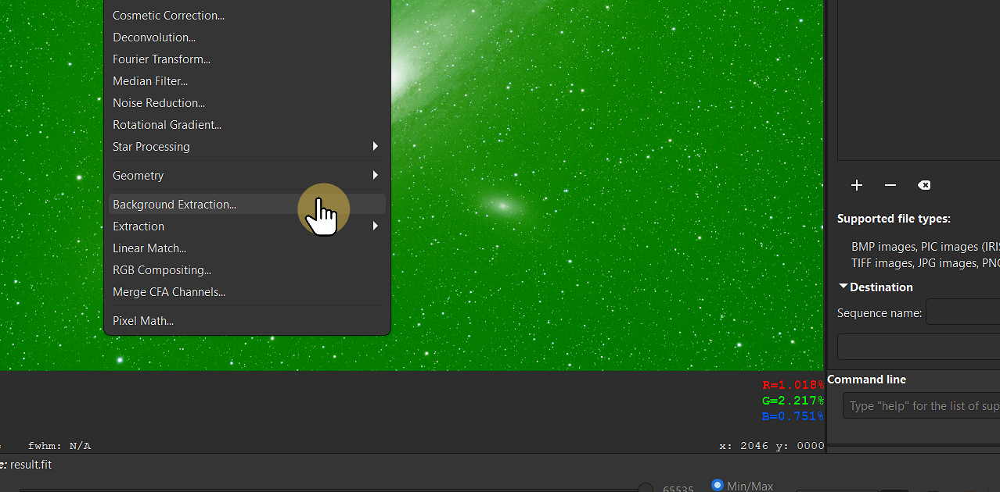
  
4. Generate samples.
  

  
**Note:** Siril uses these samples to estimate the background intensity and gradients caused by factors like light pollution or sensor noise. After selecting the samples, Siril will subtract the estimated background model from your image, creating a cleaner and more uniform background.
  
5. To ensure accurate background extraction, **right-click** on any samples that are too close to bright stars or celestial objects to remove them. This helps prevent interference from objects in the image and ensures only the background is modelled. 
  

  
6. Click on **Compute Background** to finalize the process and click apply.
  

  
### Photometric Color Calibration
  
Photometric color calibration is essential in astrophotography image stacking to correct color imbalances caused by factors like light pollution, sensor characteristics, and varying exposure conditions. In Siril, this process adjusts the colors of the stacked images to match the real-world color of celestial objects, ensuring accurate and natural-looking results. Siril achieves this by analyzing the color of stars and other objects in the image and adjusting the red, green, and blue channels to remove any unwanted color casts. This calibration is vital for creating scientifically accurate and visually consistent images, especially when stacking multiple frames with different color biases.
  
1. To perform Photometric color calibration, Click on **Color Calibration**. 
  

  
2. Select **Photometric Color Calibration**.
  

  
A window will appear where you need to enter the catalog number to match the coordinates of Right Ascension (RA) and Declination (Dec). If you're using a telescope, the coordinates will be automatically displayed. However, if you're shooting with a DSLR, the coordinate values will be set to zero by default.
  
To calibrate the images of M31 (The Andromeda Galaxy), the Catalog number is **NGC 224**.
  
You can choose from various catalogs, such as **VizieR**, **SIMBAD**, or **CDS**, to match the coordinates to the appropriate catalog entry.
  
Add the focal length and pixel size of your telescope to improve the calibration accuracy. These values help refine the photometric correction based on your equipment.
  
Once you've entered all the necessary information, click OK.
  
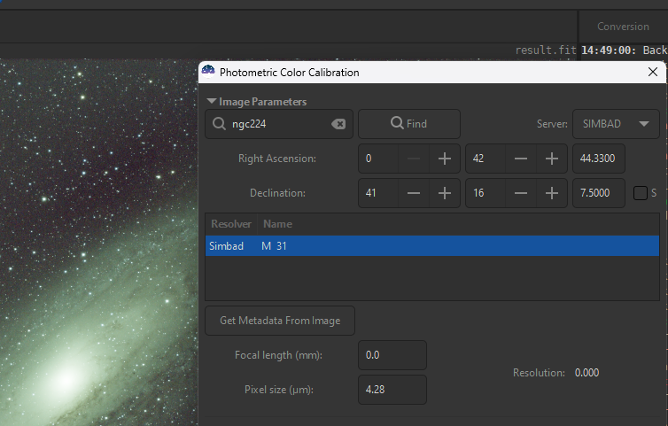
  
### Remove Green Noise
  
1. If any green noise persists in the image, click on **Remove green noise** to eliminate it.
  

  
2. Leave the default options unchanged, and simply click **Apply**.
  

  
Cleaner and more balanced image after removing the green noise.
  

  
### Strectching Image
  
1. Change the view to **linear View** and Click on **Histogram Transformation** to stretch the image. 
  

  
2. Apply the autostretch algorithm by clicking on the icon above clip%.
  

  
3. Select **Asinh transformation**. This adjustment will enhance the details in your image.
  
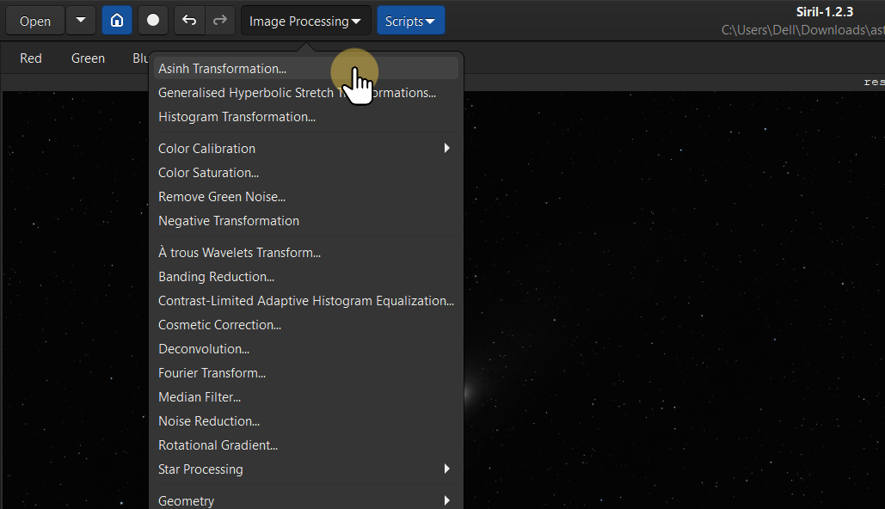
  
4. Adjust the **Strech Factor** to its maximum value to enhance the contrast and details in your image.
  

  
###  Applying Colors
  
1. Click on **Color Saturation** option to enhance the vibrancy of colors in your image.
  

  
2. Choose **Global** to access a variety of color options.
  
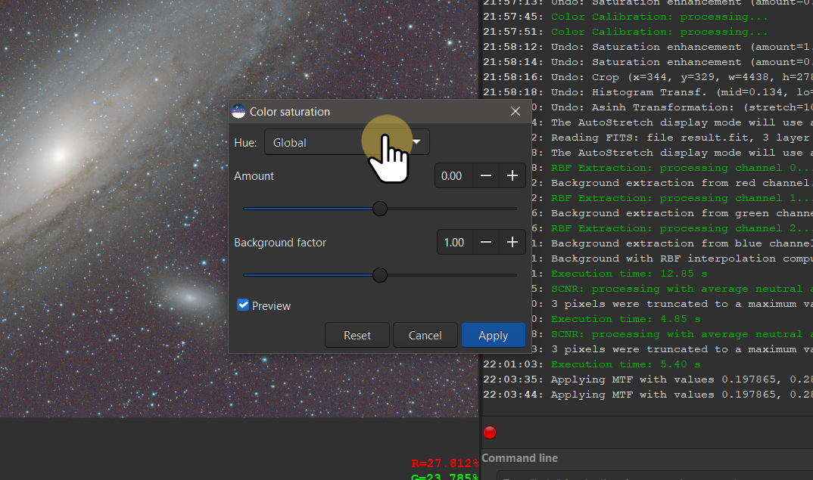
  
3. After selecting your desired color options, increase the color saturation by adjusting the **amount** slider. Click Apply to finalize and apply the changes to enhance the vibrancy of your image.
  
Here is the result of the final stacked image. You can further refine and enhance it using various photo editing softwares for additional adjustments and improvements.
  

  
Click on the **Save** or **Download** option in the top right corner to save the final result image.
  

  
When saving the image, you can select from different file formats to suit your needs.
  

  
This guide has walked you through the process of stacking astrophotography images in Siril.
  
### Conclusion
  
Overall, Siril is an incredibly powerful tool for astrophotographers, offering a range of features that make complex tasks like image stacking and calibration much easier. Its support for automation through multiple scripts is a standout feature, saving you time and effort, especially when handling large numbers of images. However, achieving the best results will require some patience and practice as you master the workflow.
  
It’s important to note that this guide is designed for beginners using telescopes for astrophotography and does not cover more advanced techniques such as generalized hyperbolic stretch transformations, deconvolution, noise reduction, or advanced star processing tools like StarNet. 
  
For those seeking deeper insight into these areas, I highly recommend checking out [Deep Space Astro](https://www.youtube.com/@DeepSpaceAstro ) on YouTube, where they provide comprehensive tutorials on advanced image processing techniques.
  
### Credits
The images used in this guide on image stacking in Siril have been sourced from **Astropix** and **AstroBackyard**. I acknowledge their invaluable contributions to this project by providing high-quality astrophotography resources.
  
For more details, visit [Astropix](https://www.astropix.com/ ) and [AstroBackyard](https://astrobackyard.com/ ).
  
### Contact Me
  
If you have any questions or would like to get in touch, feel free to reach out to me:
  
- **Email:** sathvikacharyaa@gmail.com
  
You can also connect with me on social media:
  
- [Twitter/x](https://x.com/sathvikacharyaa )
- [LinkedIn](linkedin.com/in/sathvikacharya )
- [GitHub](github.com/sathvikacharyaa )
  
  
  
  
  
  
  
  
  
  
  
  
  
  
  
  
  
  
  
  
  
